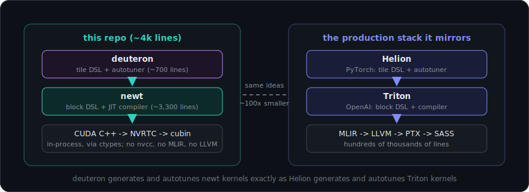
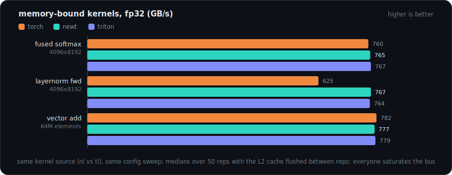
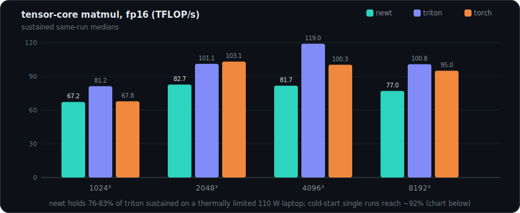
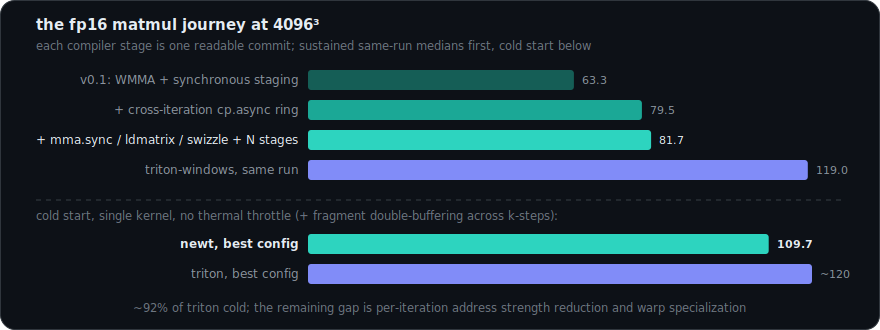
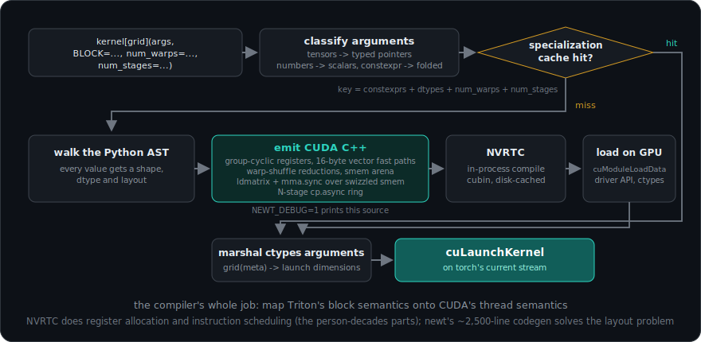
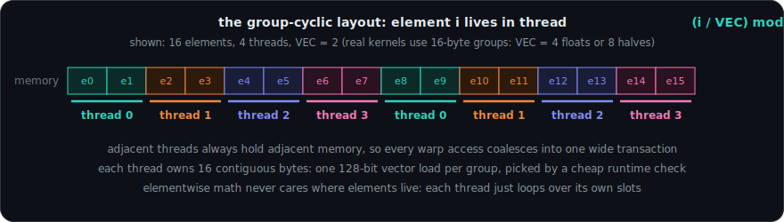
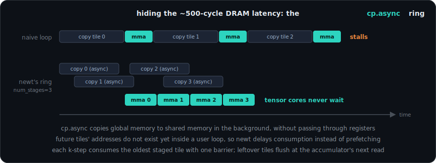
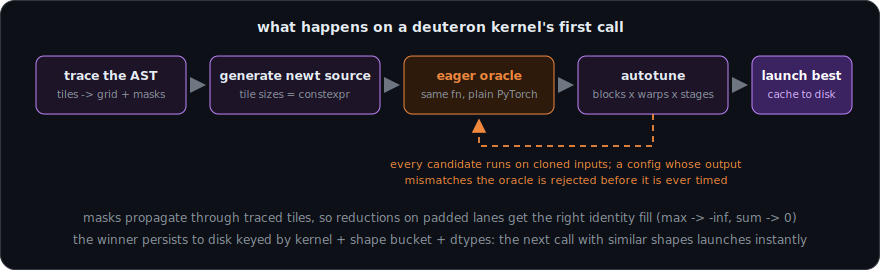

<p align="center">
  <a href="https://arpitsinghgautam.github.io/newt/"></a>
</p>

**A from-scratch nano-Triton and nano-Helion**: the modern GPU-kernel DSL
stack, rebuilt in ~4,000 lines of readable Python, reaching memory-bandwidth
parity with real Triton and 80%+ of its tensor-core matmul throughput.

*Small enough to read in an afternoon, real enough to benchmark.*

<p align="center">
  <a href="https://arpitsinghgautam.github.io/newt/"><b>Project site</b></a> |
  <a href="docs/OVERVIEW.md">The full story, from zero</a> |
  <a href="#benchmarks">Benchmarks</a> |
  <a href="#quick-start">Quick start</a>
</p>

## What this is

[Triton](https://github.com/triton-lang/triton) (OpenAI) lets you write GPU
kernels as Python functions over blocks of data; its compiler handles thread
mapping, memory coalescing, shared memory and tensor cores.
[Helion](https://github.com/pytorch/helion) (PyTorch) sits one level higher:
PyTorch-like tile code, compiled down to Triton and autotuned. Both are
large industrial compilers. Their ideas, however, are compact - and this
repo rebuilds the whole two-layer stack in miniature:

<p align="center">
  
</p>

**Highlights**

- **Real machine code, not a simulator**: kernels JIT-compile through NVRTC
  and launch through the raw CUDA driver API via ctypes. No nvcc subprocess,
  no cuda-python, no MLIR.
- **Real tensor cores**: fp16/bf16 matmuls compile to raw `ldmatrix` +
  `mma.sync` PTX over XOR-swizzled shared memory, fed by an N-stage
  `cp.async` pipeline - `num_stages` is a real tuning knob here, like in
  Triton.
- **Real performance**: memory-bound kernels (softmax, layernorm,
  elementwise) match Triton exactly; tensor-core matmul sustains 76-83% of
  triton-windows on the same machine, same source, same config sweep.
- **Triton-compatible surface**: replace `tl` with `nl` and most kernels
  just run - same `@jit`/grid protocol, `constexpr` specialization, masked
  loads/stores, `@autotune`/`@heuristics`, atomics, grids up to 3D.
- **A working nano-Helion on top**: write tile-level PyTorch-like code with
  zero kernel details; deuteron generates the newt kernel, verifies
  candidate configs against an eager PyTorch oracle, and autotunes.
- **Aggressively verified**: 176 pytest tests against PyTorch references and
  three adversarial review campaigns (500+ targeted GPU micro-repros plus a
  symbolic simulation of the pipeline state machine).

## Quick start

```
pip install -e .              # needs torch + an NVIDIA GPU + CUDA toolkit
python -m pytest tests -q     # 176 tests (GPU ones self-skip without CUDA)
```

A newt kernel is a Triton kernel with the serial numbers filed off:

```python
import torch
import newt
import newt.language as nl

@newt.jit
def add_kernel(x_ptr, y_ptr, out_ptr, n, BLOCK: nl.constexpr):
    pid = nl.program_id(0)
    offs = pid * BLOCK + nl.arange(0, BLOCK)
    mask = offs < n
    x = nl.load(x_ptr + offs, mask=mask)
    y = nl.load(y_ptr + offs, mask=mask)
    nl.store(out_ptr + offs, x + y, mask=mask)

x, y = torch.randn(2, 1_000_000, device="cuda")
out = torch.empty_like(x)
add_kernel[lambda meta: (newt.cdiv(1_000_000, meta["BLOCK"]),)](
    x, y, out, 1_000_000, BLOCK=1024)
```

And the same matmul, one level up, with no kernel-level details at all:

```python
import deuteron as dt

@dt.kernel
def matmul(x, y, out):
    for tile_m, tile_n in dt.tile([x.shape[0], y.shape[1]]):   # launch grid
        acc = dt.zeros([tile_m, tile_n], dtype=dt.float32)
        for tile_k in dt.tile(x.shape[1]):                     # k-loop
            acc += x[tile_m, tile_k] @ y[tile_k, tile_n]       # tensor cores
        out[tile_m, tile_n] = acc

matmul(x, y, out)     # traces, generates a newt kernel, autotunes, caches
matmul.ref(x, y, out) # the same function as plain PyTorch (the oracle)
print(matmul.to_newt_source(x, y, out))  # inspect the generated kernel
```

## Benchmarks

RTX PRO 5000 Blackwell Laptop GPU (sm_120), torch 2.11, triton-windows.
Identical kernel source (modulo `nl`/`tl`) and identical config sweeps for
newt and triton; medians over 50 reps with L2 flushed between reps. Full
tables in [benchmarks/results.md](benchmarks/results.md); rerun with
`python benchmarks/bench.py --cooldown 300` (it is a 110 W laptop - suites
start from a similar thermal state, and within-run columns are the fair
comparison).

**Memory-bound kernels: parity.** Once a kernel is coalesced, vectorized
and fused, everyone saturates the memory bus; there is nothing left to win.

<p align="center">
  
</p>

**Tensor-core matmul: the honest chart.** Compute-bound kernels punish
every scheduling imperfection, which is exactly what makes them the
interesting benchmark:

<p align="center">
  
</p>

**The journey.** Each stage of the compiler is a commit you can read:

<p align="center">
  
</p>

| matmul fp16 (TFLOP/s) | 1024&sup3; | 2048&sup3; | 4096&sup3; | 8192&sup3; |
|---|---|---|---|---|
| newt v0.1 (WMMA, sync staging) | 39.1 | 69.1 | 63.3 | 62.8 |
| + cross-iteration cp.async ring | 63.7 | 70.6 | 79.5 | 70.1 |
| + mma.sync/ldmatrix/swizzle + N stages | **67.2** | **82.7** | **81.7** | **77.0** |
| triton-windows (same run) | 81.2 | 101.1 | 119.0 | 100.8 |
| torch (cuBLAS, same run) | 67.8 | 103.1 | 100.3 | 95.0 |

That is **76-83% of Triton sustained** on a thermally limited laptop;
cold-start single-kernel runs reach **109.7 TFLOP/s** (~92% of Triton's own
cold numbers), up from 45-70% for the naive implementation. tf32 matmul
sits at ~45% (it still uses the WMMA path). The remaining fp16 gap is
Triton's finest-grained scheduling - per-iteration address strength
reduction and warp specialization - and the journey chart above shows
exactly which commit bought which step.

## How a newt kernel runs

<p align="center">
   classify arguments -> specialization cache -> walk the AST -> emit CUDA C++ -> NVRTC -> driver load -> marshal -> cuLaunchKernel" width="880">
</p>

The compiler's whole job is mapping Triton's *block* semantics onto CUDA's
*thread* semantics. The heart of that mapping is one rule for where a
block's elements physically live:

<p align="center">
  
</p>

Everything else follows the same pattern - pick the mapping that makes the
fast path structural, then verify it cheaply at runtime:

| Triton concept | newt implementation |
|---|---|
| program instance | one thread block, `num_warps x 32` threads |
| block tensor | registers, **group-cyclic layout**: element *i* lives in thread `(i/VEC) % T`, so warp accesses coalesce and each thread owns 16-byte groups |
| `load`/`store` | runtime-checked 128-bit vector fast path with predicated scalar fallback; no static contiguity analysis needed |
| reductions | register partials -> `__shfl_xor_sync` butterfly -> smem across warps |
| broadcasting | numel-preserving reshapes are free; real broadcasts stage through a shared-memory arena |
| `nl.dot` | raw `ldmatrix`/`mma.sync.m16n8k16` PTX over XOR-swizzled unpadded smem; fragments double-buffered across k-steps; accumulator in the documented register mapping |
| `num_stages` | an N-slot `cp.async` ring: each dot execution streams its tile in asynchronously and runs the mma for a tile staged iterations earlier, one block barrier per k-step, deferred flush at the accumulator's first read |
| `constexpr` | compile-time folding + dead-branch pruning |
| JIT cache | in-memory specialization + on-disk cubin cache |

The `num_stages` row is where most of the matmul performance lives, and it
deserves its own picture:

<p align="center">
  
</p>

## How a deuteron kernel runs

<p align="center">
   generate newt source -> eager PyTorch oracle -> correctness-filtered autotune -> launch best and cache to disk" width="880">
</p>

The oracle step is Helion's key trick, replicated: a config that compiles
and runs but computes the wrong thing is rejected before it is ever timed.
Masks propagate through traced expressions, so reductions on padded tiles
automatically get the right identity fill (max -> -inf, sum -> 0): the
layernorm example computes a correct variance on non-power-of-two rows with
no explicit mask handling at all.

## What's inside

```
newt/language.py           the nl.* DSL surface (mirrors triton.language)
newt/compiler/types.py     dtypes, pointers, promotion, broadcasting
newt/compiler/codegen.py   AST -> CUDA C++ (the compiler, ~2.5k lines)
newt/runtime/cuda.py       ctypes NVRTC + CUDA driver bindings
newt/runtime/jit.py        @newt.jit, specialization cache, launch
newt/runtime/autotuner.py  @newt.autotune / @newt.heuristics
deuteron/language.py       dt.* surface + eager (PyTorch) implementations
deuteron/codegen.py        tile-DSL AST -> newt kernel source
deuteron/runtime.py        tracing, oracle, autotuner, config cache
tests/                     176 tests, both frameworks, one suite
examples/                  vector add -> softmax -> layernorm -> autotuned
                           matmul -> fused flash attention (+ deuteron/)
benchmarks/bench.py        newt vs triton-windows vs torch
docs/                      the project site (GitHub Pages), OVERVIEW.md,
                           and the SVG diagrams used here
```

## Correctness

- 176 pytest tests: every op vs torch references, control flow, autotuning,
  boundary masks, the pipeline state machine, and regression tests for every
  bug ever found.
- Three adversarial review campaigns ran 500+ targeted GPU micro-repros
  against the compiler (sync hazards, layout algebra, swizzle consistency,
  wait-counting under interleaved pipelines) plus a symbolic simulation of
  the N-stage ring; every confirmed finding was fixed with a regression
  test (see `tests/test_review_fixes.py` and `tests/test_pipeline_dot.py`).
- CI runs lint + GPU-free compiler-structure tests (the generated CUDA is
  validated without a GPU) on every push.

## What's supported

`program_id` `num_programs` `arange` `zeros` `full` `load` `store`
(masks + `other`), full arithmetic/comparison/bitwise ops with numpy-style
broadcasting, `where` `maximum` `minimum` `fma`, `exp` `log` `exp2` `log2`
`sqrt` `rsqrt` `sin` `cos` `tanh` `erf` `sigmoid` `abs` `floor` `ceil`,
`sum` `max` `min` (full + axis), `dot` (+accumulator), `.to()` casts,
`expand_dims` / `x[:, None]`, `reshape` `trans` `broadcast_to`,
`atomic_add` `atomic_max`, `cdiv` `static_assert` `static_print`,
`for range()` / `while` / `if` with constexpr pruning, tuple unpacking,
fp32 / fp16 / bf16 / fp64 / int8-64 / uint / bool, grids up to 3D,
`num_warps` 1-32, `num_stages` 1-8, `@autotune` / `@heuristics`.

**Known limitations (by design, it's a nano):** block dims must be powers of
two; `tl.rand`/philox, `device_print`, and calling other `@jit` functions
are omitted; `/` `%` `//` on integer blocks follow C truncation; pointer
offsets are int32; fp32 `dot` uses tf32 tensor cores (Triton's default too)
via the WMMA path.

## Docs

- **[The project site](https://arpitsinghgautam.github.io/newt/)** - the
  whole story on one page: a from-zero primer, the architecture with
  diagrams, benchmarks and a glossary.
- [docs/OVERVIEW.md](docs/OVERVIEW.md) - the same story in markdown, written
  for readers who don't yet know what a kernel or Triton is.
- The git history doubles as the build log: each compiler stage in the
  journey table above is a self-contained commit.

> *Why "newt"? **Triton** was the original genus name for newts (Laurenti,
> 1768) - a newt is literally a small triton. A **deuteron** is a lighter
> nucleus than a **helion**. MIT licensed.*
