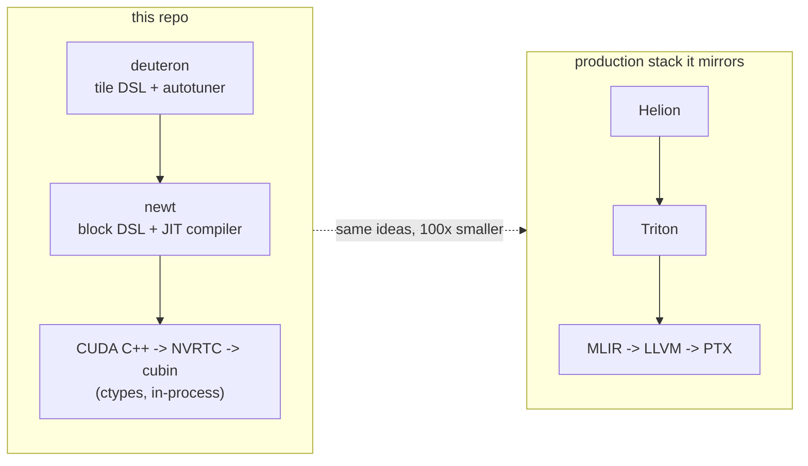
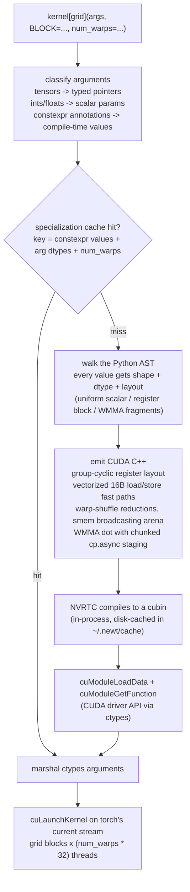
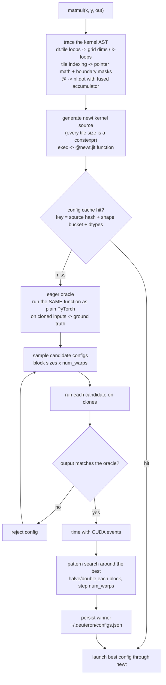

# newt 🦎

A **mini-Triton**: the [Triton](https://github.com/triton-lang/triton) GPU
programming model - block-level kernels written in Python, JIT-compiled to
real GPU machine code - reimplemented from scratch in ~3,000 lines of
readable Python, in the spirit of
[nano-vllm](https://github.com/GeeeekExplorer/nano-vllm).

The repo also contains **[deuteron](deuteron/)** ⚛, a mini-
[Helion](https://github.com/pytorch/helion) built on top of newt: a
PyTorch-like tile DSL that generates newt kernels and autotunes them
automatically. Together they replicate the modern two-layer kernel-DSL
stack in miniature:



> *Why "newt"? **Triton** was the original genus name for newts
> (Laurenti, 1768). A newt is literally a small triton. A deuteron is a
> lighter nucleus than a helion.*

## Quick taste

```python
import torch
import newt
import newt.language as nl

@newt.jit
def add_kernel(x_ptr, y_ptr, out_ptr, n, BLOCK: nl.constexpr):
    pid = nl.program_id(0)
    offs = pid * BLOCK + nl.arange(0, BLOCK)
    mask = offs < n
    x = nl.load(x_ptr + offs, mask=mask)
    y = nl.load(y_ptr + offs, mask=mask)
    nl.store(out_ptr + offs, x + y, mask=mask)

x, y = torch.randn(2, 1_000_000, device="cuda")
out = torch.empty_like(x)
add_kernel[lambda meta: (newt.cdiv(1_000_000, meta["BLOCK"]),)](
    x, y, out, 1_000_000, BLOCK=1024)
```

If you know Triton, you know newt: replace `tl` with `nl` and it usually
just runs. Same `@jit`/grid launch protocol, `constexpr` specialization,
`@autotune`/`@heuristics` decorators, masked load/store semantics,
tensor-core `nl.dot`, and the same "one program = one tile" mental model.

And the same computation, one level up, in deuteron:

```python
import deuteron as dt

@dt.kernel
def matmul(x, y, out):
    for tile_m, tile_n in dt.tile([x.shape[0], y.shape[1]]):   # launch grid
        acc = dt.zeros([tile_m, tile_n], dtype=dt.float32)
        for tile_k in dt.tile(x.shape[1]):                     # k-loop
            acc += x[tile_m, tile_k] @ y[tile_k, tile_n]       # tensor cores
        out[tile_m, tile_n] = acc

matmul(x, y, out)   # traces, generates a newt kernel, autotunes, caches
```

## What happens when you call a newt kernel



The compiler's whole job is mapping Triton's *block* semantics onto CUDA's
*thread* semantics:

| Triton concept | newt implementation |
|---|---|
| program instance | one thread block, `num_warps × 32` threads |
| block tensor | registers, **group-cyclic layout**: element *i* lives in thread `(i/VEC) % T`, so warp accesses coalesce and each thread owns 16-byte groups |
| `load`/`store` | runtime-checked vector fast path (128-bit `ld.global`) with predicated scalar fallback; no static contiguity analysis needed |
| reductions | register partials -> `__shfl_xor_sync` butterfly -> smem across warps |
| broadcasting | numel-preserving reshapes are free; real broadcasts stage through a shared-memory arena |
| `nl.dot` | smem staging + **WMMA tensor cores** (fp16/bf16 -> hmma, fp32 -> tf32); operands coming straight from `nl.load` stream global->shared with **`cp.async` in K-chunks**, overlapping the copy of chunk k+1 with the math of chunk k |
| `constexpr` | compile-time folding + dead-branch pruning |
| JIT cache | specialization on (constexprs, arg dtypes, num_warps), in-memory + on-disk cubin cache |

## What happens when you call a deuteron kernel



The oracle step is the Helion trick that makes autotuning safe: a config
that compiles and runs but computes the wrong thing is rejected before it
is ever timed. `matmul.ref(x, y, out)` runs the oracle directly, and
`matmul.to_newt_source(x, y, out)` prints the generated kernel (it looks
exactly like the hand-written Triton tutorial matmul).

## Performance

Measured on an RTX PRO 5000 Blackwell Laptop GPU (sm_120), idle, identical
kernel source and config sweep for newt and triton-windows (full tables:
[benchmarks/results.md](benchmarks/results.md); rerun with
`python benchmarks/bench.py`):

| kernel | torch | **newt** | triton |
|---|---|---|---|
| vector add 64M (GB/s) | 782 | **777** | 779 |
| fused softmax 4096×8192 (GB/s) | 694 | **750** | 763 |
| layernorm 4096×8192 (GB/s) | 626 | **767** | 760 |
| matmul fp16 4096³ (TFLOP/s) | 99.0 | **79.5** | 113.2 |
| matmul fp16 8192³ (TFLOP/s) | 90.4 | **70.1** | 85.6 |
| matmul tf32 8192³ (TFLOP/s) | 55.5 | **20.2** | 41.3 |

**Why the memory-bound kernels hit parity.** Add, softmax and layernorm are
DRAM-bandwidth-bound: the winner is whoever issues wide, coalesced memory
transactions and keeps enough threads in flight, and nothing else matters.
newt gets there by construction: the group-cyclic layout makes every warp
access coalesced, the runtime-checked fast path turns loads into the same
128-bit vector instructions Triton emits, fusion keeps each row in
registers for one read and one write, and NVRTC schedules the resulting
straight-line C++ as well as Triton's LLVM pipeline schedules its IR. Once
both compilers saturate the memory bus there is no headroom left to differ,
which is also why newt occasionally wins (a slightly better num_warps pick
at a given size).

**Why matmul fp16 is at ~70-80%.** Matmul is compute-bound: the winner is
whoever keeps the tensor cores fed *every* cycle. newt hides memory latency
with cross-iteration pipelining: each `nl.dot` execution streams its tile
into a double-buffered shared-memory ring with `cp.async` and runs the mma
for the tile staged by the *previous* loop iteration, so the copy overlaps
a full iteration of tensor-core math (a deferred flush consumes the final
tile at the accumulator's first downstream read). That transformation took
newt from ~45-70% to ~70-82% of Triton. The remaining gap is Triton's
lowest layer: `mma.sync` PTX with *swizzled* (fully conflict-free) shared
memory instead of newt's coarser WMMA API with padded tiles, register
double-buffering of fragments, and 3-4 stage pipelines instead of 2. tf32
sits lower (~45%) because its small K-fragments (k=8) leave less math per
tile to hide latency behind. All of that is the known next step, not an
unknown.

## What's supported

`program_id` `num_programs` `arange` `zeros` `full` `load` `store`
(masks + `other`), full arithmetic/comparison/bitwise ops with numpy-style
broadcasting, `where` `maximum` `minimum` `fma`, `exp` `log` `exp2` `log2`
`sqrt` `rsqrt` `sin` `cos` `tanh` `erf` `sigmoid` `abs` `floor` `ceil`,
`sum` `max` `min` (full + axis), `dot` (+accumulator), `.to()` casts,
`expand_dims` / `x[:, None]`, `reshape` `trans` `broadcast_to`,
`atomic_add` `atomic_max`, `cdiv` `static_assert` `static_print`,
`for range()` / `while` / `if` with constexpr pruning, tuple unpacking,
fp32 / fp16 / bf16 / fp64 / int8-64 / uint / bool, grids up to 3D,
`num_warps` 1-32, `@autotune` / `@heuristics`.

See [examples/](examples/) (vector add -> fused softmax -> layernorm ->
autotuned matmul -> **fused flash attention**), 160+ tests in
[tests/](tests/), and [test.ipynb](test.ipynb) for a NumPy-verified
walkthrough of both frameworks.

## Layout

```
newt/language.py           the nl.* DSL surface (mirrors triton.language)
newt/compiler/types.py     dtypes, pointers, promotion, broadcasting
newt/compiler/codegen.py   AST -> CUDA C++ (the compiler)
newt/runtime/cuda.py       ctypes NVRTC + CUDA driver bindings
newt/runtime/jit.py        @newt.jit, specialization, launch
newt/runtime/autotuner.py  @newt.autotune / @newt.heuristics
deuteron/                  the mini-Helion package (own README inside)
tests/                     both frameworks, one pytest suite
examples/                  newt examples + examples/deuteron/
benchmarks/                newt vs triton-windows vs torch
test.ipynb                 NumPy-verified matmul walkthrough
```

## Known limitations (by design, it's a mini)

- Block dims must be powers of two (like `tl.arange`).
- Cross-iteration `num_stages` pipelining is a no-op (accepted, ignored);
  `tl.rand`/philox, `device_print`, and calling other `@jit` functions are
  omitted.
- `/` `%` `//` on integer blocks follow C truncation semantics.
- Pointer offsets are int32 (tensors < 2³¹ elements).
- fp32 `dot` always uses tf32 tensor cores (Triton's default too).

## Install

```
pip install -e .             # installs newt + deuteron
                             # (needs torch + NVIDIA GPU + CUDA toolkit)
python -m pytest tests -q    # 165 tests, both frameworks
```

Works on Windows (developed on one; NVRTC DLL discovery included) and Linux.
See [OVERVIEW.md](OVERVIEW.md) for the problem statement and approach,
[PLAN.md](PLAN.md) for architecture decisions, and [LOG.md](LOG.md) for the
build log.
